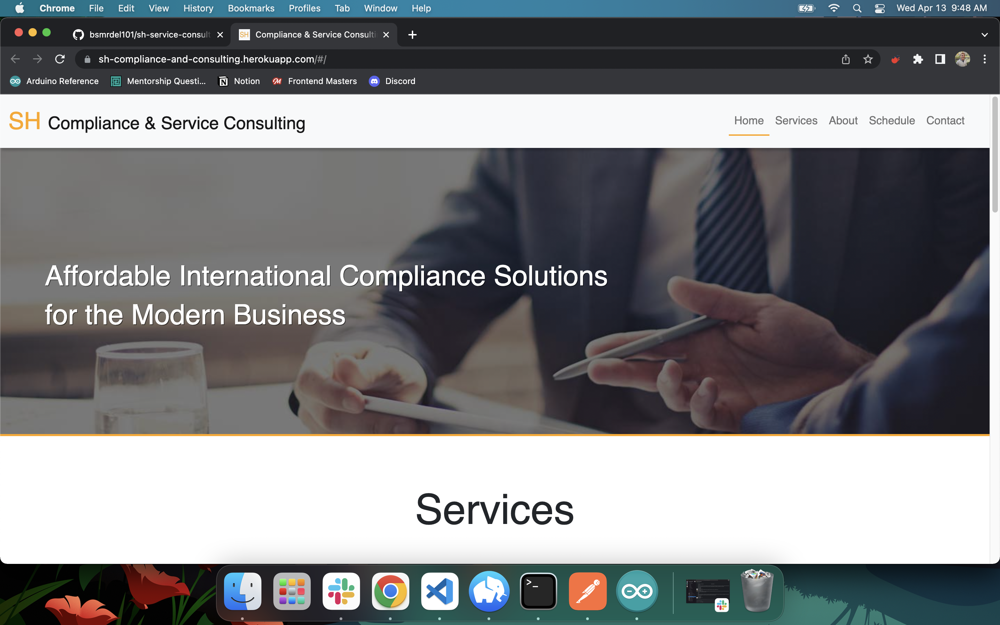
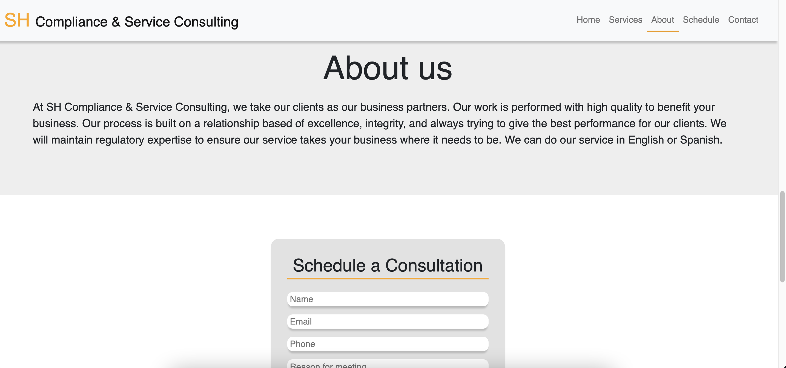

# SH Compliance and Service Consulting

## Description

This consulting company commissioned me to build them a website to show off their business to clients. It displays their services, contact, about sections, and a form to schedule a consultation(Which will send an email with the meeting details).

## Screen Shots

## Getting Started

These instructions will get you a copy of the project up and running on your local machine for development and testing purposes. See deployment for notes on how to deploy the project on a live system.

### Prerequisites

- [Node.js](https://nodejs.org/en/)
- [PostrgeSQL](https://www.postgresql.org/)

### Installing

- Run `npm install`
- Running the server code requires `nodemon`. If you don't already have `nodemon`, install it globally with `npm install nodemon --global`. 
- Run `npm run server`
- Run `npm run client`
- Navigate to `localhost:3000`

## Built With

- Javascript
- Node.js
- Express.js
- React
- Redux
- Sagas
- PostgreSQL
- MaterialUI

## License

This project is licensed under the MIT License - see the [LICENSE.md](LICENSE.md) file for details
